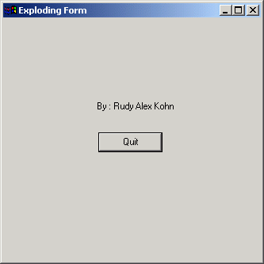



## Explode / Implode Form Window\(s\)

### Description

'Explodes/Implodes' form.

(Look at screenshot to see what i mean)

Looking for a nice touch when closing you'r forms?

Then this might be something for you.

Creates a nice effect, and can easily be modified to suit special needs.

It also shows how to stop user from closing form with 'X' in one small line.
 
### More Info
 

             |
---                |---
**Submitted On**   |2001-05-06 15:00:52
**By**             |[rudz](https://github.com/Planet-Source-Code/PSCIndex/blob/master/ByAuthor/rudz.md)
**Level**          |Intermediate
**User Rating**    |4.0 (8 globes from 2 users)
**Compatibility**  |VB 4\.0 \(32\-bit\), VB 5\.0, VB 6\.0
**Category**       |[Custom Controls/ Forms/  Menus](https://github.com/Planet-Source-Code/PSCIndex/blob/master/ByCategory/custom-controls-forms-menus__1-4.md)
**World**          |[Visual Basic](https://github.com/Planet-Source-Code/PSCIndex/blob/master/ByWorld/visual-basic.md)
**Archive File**   |[Explode \_ 19292562001\.zip](https://github.com/Planet-Source-Code/rudz-explode-implode-form-window-s__1-22993/archive/master.zip)

